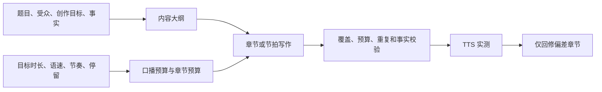

# 时长驱动文案与长短视频生成改造规划

> 状态：P0 / P1 / P2 已落地（P3 后台任务队列未做）
>
> 目标：把“按预算写稿”从单一的字数控制，升级为可解释、可校验、可回修的创作流程。时长负责控制篇幅和节奏；主题、受众、论点和事实负责决定写什么。

## 1. 结论与设计原则

按时间驱动生成文案是合理的，但时间不能直接决定内容。正确关系如下：



系统必须遵守以下原则：

1. 时长是篇幅和节奏约束，不是让模型“估秒数”的提示词装饰。
2. 目标创作和已有文案是两种输入模式，不能混为一谈。
3. 短、中、长、深度长视频使用不同的编排与生成策略，但共享预算、校验、分镜和 TTS 对齐能力。
4. 长视频先确认全片结构，再逐章写作；禁止一次请求生成整篇再盲目截断。
5. TTS 实测结果是最终时长事实。字数估算只用于规划。
6. 生成失败或质量校验失败时，不得静默替换为短稿。

## 2. 当前基础与本次改造边界

当前项目已经具备可复用的基础：

| 现有能力 | 位置 | 本次如何复用 |
|---|---|---|
| `target-driven` / `content-driven` | `src/types.ts`、`src/utils/scriptBudget.ts` | 保留为两类输入模式 |
| 语速、语言、停留换算字数/词数 | `src/utils/scriptBudget.ts`、`src/utils/scriptLanguage.ts` | 继续作为预算来源 |
| `≥90s` 章节规划 | `src/utils/scriptDuration.ts`、`src/utils/scriptSections.ts` | 替换为更细的内容形态分层 |
| 长稿逐章生成及重试 | `server.ts` 的 `/api/script/draft` | 改为“提纲确认后逐章写作” |
| 全文、章节、节拍覆盖校验 | `src/utils/scriptDraft.ts` | 扩展为结构、重复、实测偏差校验 |
| 真实 TTS 时长记录 | `src/App.tsx`、`DurationBudget` | 变为可触发局部回修的输入 |
| 口播—节拍—分镜链路 | `src/components/ScriptPanel.tsx` | 保持后续分镜流程不变 |

本次不重做选题、画面圣经、coverage、生图和导出。它们继续消费稳定的 `fullNarration`、`sections`、`beats` 与 `forecastShots`。

## 3. 内容形态分层

不要再只用“短视频/长视频”的二元判断。新增 `ScriptForm`，由目标时长自动推导，也允许用户在高级设置中覆盖。

| 形态 | 时长 | 生成方法 | 典型内容 | 用户检查点 |
|---|---:|---|---|---|
| `short` | 8–60 秒 | 一次生成完整口播和 4–8 节拍 | 金句、带货、单点反常识 | 生成后直接编辑 |
| `medium` | 61–180 秒 | 先生成轻量提纲，再一次生成 3–6 段 | 三步教程、轻科普、热点解释 | 可选确认提纲 |
| `long` | 181–600 秒 | 全片提纲确认后逐章生成、逐章校验 | 深度科普、案例、完整故事 | 必须确认提纲 |
| `extended` | 601–1800 秒 | 章节级工作区、分批生成、分批 TTS 与分批分镜 | 课程、纪录片、访谈式讲解 | 必须确认提纲和章节顺序 |

```ts
export type ScriptForm = 'short' | 'medium' | 'long' | 'extended';

export function scriptFormForSeconds(seconds: number): ScriptForm {
  if (seconds <= 60) return 'short';
  if (seconds <= 180) return 'medium';
  if (seconds <= 600) return 'long';
  return 'extended';
}
```

### 3.1 分层阈值的含义

- 60 秒以内，用户期待的是密度和抓力；先看成稿比先看大纲更高效。
- 61–180 秒，开始存在多个信息点，但仍可在一轮编辑中理解全篇。
- 3 分钟以上，结构、论据、人物和术语会跨段复用，必须先锁大纲。
- 10 分钟以上，单次请求、单次 TTS、单次镜头编排都会过大；必须按章节独立操作和保存。

## 4. 时长预算模型

### 4.1 字段改名与语义收敛

当前 `maxChars` 同时像“目标”和“上限”，容易诱导模型只写得比它短。将预算字段收敛为下列语义；保留旧字段迁移以兼容已保存工程。

```ts
interface ScriptLengthBudget {
  targetSeconds: number;
  speechTargetSeconds: number;
  visualHoldTargetSeconds: number;
  unitsPerSecond: number; // 中文为汉字/秒，英文为词/秒
  targetUnits: number;
  minUnits: number;
  maxUnits: number;
  measuredSpeechSeconds?: number;
  measuredTotalSeconds?: number;
}
```

计算规则：

```text
speechTargetSeconds = targetSeconds - visualHoldTargetSeconds
targetUnits = round(speechTargetSeconds × unitsPerSecond)
minUnits = ceil(targetUnits × 0.90)
maxUnits = ceil(targetUnits × 1.05)
```

兼容策略：

- `DurationBudget.maxChars` 暂时保留，值等于 `targetUnits`。
- 所有新提示词、页面文案和校验提示使用“目标 X 字/词（允许 Y–Z）”，不再说“最多 X 字/词”。
- 已有项目加载时，根据现有 `maxChars` 生成 `targetUnits`、`minUnits` 和 `maxUnits`。

### 4.2 停留不再只按固定比例

当前按节奏档固定扣除停留比例可作为初始估计，但不应是最终约束。改为两阶段：

1. 写稿前：用节奏预设给出初始 `visualHoldTargetSeconds`。
2. 章节/节拍完成后：根据 `needsHold`、章节转场、金句、演示动作和结尾重新分配停留。

规则：教程和新闻以口播密度为主，初始停留较少；故事、情绪、电影感内容允许更多停留。禁止用无信息的空画面补足缺少的口播。

## 5. 两种输入模式

### 5.1 目标驱动 `target-driven`

适用于“我想做一条 3 分钟科普/教程/故事”。用户提供目标时长，系统按预算生成文案。

必须校验：

- 成稿处于 `minUnits–maxUnits`；
- 长视频每章处于本章预算区间；
- 章节、节拍和全文按顺序完整覆盖；
- 章节角色、论点和事实不冲突；
- 实测 TTS 后偏差在容忍范围内，或进入回修建议。

### 5.2 内容驱动 `content-driven`

适用于“我已经有一篇稿，帮我判断能拍多久”。已有正文是权威输入，系统反推时长和分镜，不能强迫其满足某个预设字数。

必须提供三个明确操作：

1. 保持文案，采用预计时长；
2. 压缩到某个目标时长；
3. 扩写到某个目标时长。

其中 2 和 3 必须走“局部改稿计划”，先列出建议删/补哪一章或哪几个句群，禁止直接随机重写整篇。

## 6. 目标驱动的生成流程

### 6.1 短视频 `short`

请求一次完成，返回标题、连续口播、4–8 个节拍和可见的 `visualIntent`。


短视频提示词应强调：一个主张、一个反差或一个结果、首三秒钩子、结尾收束；不得为了填时长引入第二主题。

### 6.2 中视频 `medium`

先生成“轻提纲”，默认自动通过，但在页面提供展开和编辑入口。提纲由 3–6 个段落组成，每段只有一个明确任务。

```text
题目 → 轻提纲（段落任务 + 预算）→ 一次生成各段 → 合稿校验 → 编辑
```

中视频不应要求人工确认才可写稿，以保持快捷体验；用户可勾选“生成前先确认提纲”。

### 6.3 长视频 `long`

必须分为两个用户可见阶段。


创作简报至少包括：

| 字段 | 必填 | 说明 |
|---|---|---|
| 核心问题 | 是 | 观众看完需要得到什么答案 |
| 目标受众 | 是 | 初学者、已有基础、潜在购买者等 |
| 核心结论 | 是 | 全片最终要证明或交付的结论 |
| 事实与证据 | 建议 | 用户提供或调研确认的事实，不允许模型编造 |
| 禁区 | 否 | 不谈什么、避免什么承诺、不能改的术语 |
| 行动目标 | 否 | 关注、理解、尝试、购买、留言等 |

全片提纲中每章必须包含：章节标题、章节角色、观众问题、章节承诺、证据 ID、目标时长、目标字数/词数、与前后章节的衔接说明。

章节生成按照顺序执行，但每章输入必须包含：

- 全片结论和受众；
- 已确认提纲及当前章节预算；
- 已生成章节的压缩摘要，而不是仅上一章末尾 80 字；
- 全局事实账本和术语表；
- 已建立的人物、地点、产品或案例的稳定 ID；
- 当前章禁止重复的已讲内容列表。

### 6.4 深度长视频 `extended`

不要以一个 HTTP 请求完成全部任务。改为章节级任务队列和持久状态。

- 用户确认提纲后，单独生成“第 1 章”；
- 可选择“生成下一章”或“按顺序全部生成”；
- 每章完成后立刻落盘；失败可只重试该章；
- TTS、分镜、翻译和 coverage 也按章节/批次运行；
- 全片合稿只做覆盖、术语、重复和过渡校验，不重写已锁定章节。

## 7. 新增数据模型

在 `src/types.ts` 中增加以下类型。字段名称可微调，但语义不能删减。

```ts
export type ScriptForm = 'short' | 'medium' | 'long' | 'extended';
export type OutlineStatus = 'none' | 'draft' | 'confirmed' | 'stale';
export type SectionStatus = 'planned' | 'drafting' | 'ready' | 'locked' | 'needs-revision' | 'failed';
export type RevisionReason =
  | 'under-duration'
  | 'over-duration'
  | 'missing-evidence'
  | 'repetition'
  | 'transition'
  | 'manual';

export interface ScriptBrief {
  audience: string;
  coreQuestion: string;
  coreConclusion: string;
  evidence: Array<{
    id: string;
    claim: string;
    source?: string;
    confidence: 'user' | 'researched' | 'unverified';
  }>;
  forbiddenClaims: string[];
  requiredTerms: string[];
  callToAction?: string;
}

export interface ScriptOutlineSection {
  id: string;
  order: number;
  title: string;
  role: ScriptSectionRole;
  audienceQuestion: string;
  promise: string;
  evidenceIds: string[];
  bridgeFromPrevious: string;
  bridgeToNext: string;
  targetSeconds: number;
  targetUnits: number;
  minUnits: number;
  maxUnits: number;
  status: SectionStatus;
}

export interface ScriptOutline {
  status: OutlineStatus;
  version: number;
  oneSentenceThesis: string;
  sections: ScriptOutlineSection[];
  confirmedAt?: number;
}

export interface ScriptRevisionPlan {
  reason: RevisionReason;
  measuredSeconds: number;
  targetSeconds: number;
  deltaSeconds: number;
  sectionActions: Array<{
    sectionId: string;
    action: 'expand' | 'compress' | 'replace-transition';
    targetDeltaUnits: number;
    instruction: string;
  }>;
}
```

在 `ScriptWorkspace` 中增加：

```ts
scriptForm?: ScriptForm;
brief?: ScriptBrief;
outline?: ScriptOutline;
revisionPlan?: ScriptRevisionPlan | null;
```

迁移规则：旧项目加载时，依目标时长派生 `scriptForm`；已有 `sections` 生成 `outline.status = 'draft'`；不要求用户补填创作简报才能继续编辑旧稿。

## 8. 接口设计

保留 `/api/script/draft` 作为兼容入口，但分解新接口，避免一个端点承担所有状态和超时。

| 接口 | 适用形态 | 请求 | 响应 |
|---|---|---|---|
| `POST /api/script/outline` | medium / long / extended | brief、budget、genre、已有 outline | `ScriptOutline` |
| `POST /api/script/section-draft` | long / extended | brief、outline、sectionId、已完成章节摘要、budget | 一个完整 `ScriptSection` |
| `POST /api/script/validate` | 所有 | narration、sections、outline、budget | 结构/篇幅/覆盖/重复报告 |
| `POST /api/script/revision-plan` | 所有 | 测量时长、目标、sections、validation | `ScriptRevisionPlan` |
| `POST /api/script/section-revise` | medium / long / extended | section、revision action、brief、outline | 修改后的一个 `ScriptSection` |

`/api/script/draft` 的目标行为：

- `short`：保持单次写稿；
- `medium`：可内部调用 outline + 合稿；
- `long`/`extended`：若 outline 未确认，返回 `outline_required` 和提纲，不得直接写正文；
- 旧客户端若没有 `scriptForm`，由 `targetSeconds` 推导。

错误响应统一包含：

```ts
{
  error: string;
  code: 'outline_required' | 'llm_connection_failed' | 'llm_timeout' |
        'llm_response_invalid' | 'draft_contract_failed';
  detail?: string;
  recommendation?: string;
  validationDetail?: string;
}
```

## 9. 提纲与事实校验

### 9.1 全片结构规则

- 每章只回答一个主要问题或完成一个叙事任务。
- `promise` 不能只是“继续讲解”“展开说明”。
- 非故事内容的相邻章节不得讲同一证据或同一结论。
- 故事内容必须具有因果推进，不能只按时间顺序罗列事件。
- `evidenceIds` 只能引用 `ScriptBrief.evidence` 中已存在的 ID；没有证据时必须明确标注“观点/经验”，不能伪装为事实。
- 前两章必须交付可感知的信息增量，不能把引言拉长填时长。
- 最后章节回收核心结论，不得引入新的主要论点。

### 9.2 文本级校验

在 `src/utils/scriptDraft.ts` 的现有覆盖校验之外，增加纯函数校验：

```ts
validateOutline(outline, brief, budget): ValidationResult
validateSectionAgainstOutline(section, outlineSection, brief): ValidationResult
validateScriptProgression(sections, outline, language): ValidationResult
buildRevisionPlan(input): ScriptRevisionPlan
```

最小可实现规则：

- 每章字数/词数位于本章 `minUnits–maxUnits`；
- 每章 `beats.narration` 完整覆盖章节 `narration`；
- 全文完整覆盖所有章节；
- 章节顺序和 outline 一致；
- evidence ID 均存在；
- 相邻章节去空白后的前 60 个字符不能完全相同；
- 同一章节标题、核心结论、CTA 不得重复出现超过一次；
- `target-driven` 的总预算范围为 90%–105%。

重复检测一期可使用句子标准化和 n-gram 相似度；不要为了引入向量数据库阻塞交付。

## 10. TTS 实测与局部回修

### 10.1 触发条件

TTS 生成和对齐完成后，已有代码会写入 `actualSpeechSeconds` 与 `actualTotalSeconds`。在此基础上加入：

```text
timeDelta = measuredTotalSeconds - targetSeconds
tolerance = max(2 秒, targetSeconds × 0.05)
```

- `abs(timeDelta) <= tolerance`：显示“时长已实测匹配”；
- 超时：生成压缩计划；
- 不足：生成扩写计划；
- 用户确认后只调用有动作的章节修订接口。

### 10.2 修订分配规则

- 优先处理可扩写/可压缩的 body、proof、example 章节；
- hook、核心结论、CTA 默认不压缩，除非用户主动选择；
- 章节被 `locked` 后不自动修改；
- 单章修订量不得超过本章目标字数的 20%，超出时分配给多章或提示用户调整目标时长；
- 修订后重跑全文覆盖和结构校验；TTS 仅重新合成被改变的片段或整段旁白。

页面必须明确展示“预计”和“实测”，不得将字数估算标为精确时长。

## 11. 前端工作流

### 11.1 时长页

- 保留平台、节奏、秒数、锁镜数和预算环。
- 文案改为“目标口播 X 字/词，允许 Y–Z；预计口播 A 秒，预计画面停留 B 秒”。
- 根据 `scriptForm` 显示标签：短视频、段落视频、章节视频、深度长视频。
- 对 `long` 和 `extended`，“按预算写稿”按钮改为“生成全片提纲”。

### 11.2 新增提纲页

在现有阶段轨中，将 `beats` 阶段在 medium 以上显示为“提纲 / 章节”。不必改变短视频的阶段名称。

页面组成：

1. 创作简报表单：核心问题、受众、核心结论、事实、禁区、行动目标；
2. 章节列表：标题、章节任务、证据、目标秒数、目标字数/词数；
3. 编辑、上移、下移、删除、添加章节；
4. `long` / `extended` 的“确认提纲并生成第 1 章”主按钮；
5. 提纲变更后，将已生成但不再匹配的章节标记 `needs-revision`，不得静默删除正文。

### 11.3 章节写作页

长视频口播编辑器上方增加章节导航：

- `planned`：尚未生成；
- `drafting`：生成中；
- `ready`：通过校验；
- `locked`：用户锁定；
- `needs-revision`：提纲、事实或时长变更后需要处理；
- `failed`：展示服务端结构化错误，可重试本章。

操作：生成当前章、生成下一章、全部生成未完成章节、重写当前章、锁定当前章。`extended` 不能出现“重新生成全文”主按钮。

### 11.4 实测回修提示

在 TTS 实测完成后，口播页显示：

```text
目标 180s · 实测 194s · 超出 14s
建议：第 4 章压缩约 25 字，第 5 章压缩约 18 字。
[查看修改计划] [按计划回修] [保留当前时长]
```

用户点击“按计划回修”前可编辑或删除每项章节动作。修订后的章节必须再次进入正常校验。

## 12. 模型提示词契约

### 12.1 提纲生成提示词

系统提示词职责：只定义创作角色、事实边界和 JSON 规则。用户提示词提供具体 brief、预算和章节要求。

核心约束：

```text
你是长视频编导与结构编辑，不是一次性文案续写器。
先规划观众获得信息的顺序，再写章节。
不得把用户未提供或未确认的事实写成事实；不确定的内容标为观点或待核实。
每章只完成一个明确任务，并且必须给观众带来新的信息、证据、步骤或因果推进。
不得为了填满时长重复题目、重复结论或写空泛过渡。
只输出指定 JSON，禁止 Markdown。
```

提纲 JSON：

```json
{
  "oneSentenceThesis": "string",
  "sections": [
    {
      "id": "section-1",
      "title": "string",
      "audienceQuestion": "string",
      "promise": "string",
      "evidenceIds": ["evidence-1"],
      "bridgeFromPrevious": "string",
      "bridgeToNext": "string"
    }
  ]
}
```

服务端负责补回 id、role、预算和 status，不能信任模型生成的预算。

### 12.2 章节生成提示词

```text
你只写指定章节，不能改题、不能改全片结论、不能改变其他章节。
本章口播必须在 {minUnits}–{maxUnits} {unit} 内；节拍口播按顺序拼接后必须逐字覆盖本章正文。
本章必须兑现 promise，并且仅使用列出的 evidenceIds 对应事实；没有证据时使用“观点/经验”表达，禁止伪造来源、数据、人物和案例。
不要重复已讲内容。用 bridgeFromPrevious 自然承接，但不要重新复述上一章。
不要预告下一章的完整答案，只留下能推动观看的必要衔接。
每个 beat 必须给可拍的 visualIntent；不得使用“很有氛围”“电影感”等抽象占位词。
只输出 JSON。
```

章节 JSON：

```json
{
  "narration": "string",
  "beats": [
    {
      "function": "hook|setup|turn|proof|reveal|cta",
      "intent": "string",
      "narration": "string",
      "energy": "fast|medium|slow|hold",
      "visualIntent": "string",
      "needsHold": false
    }
  ],
  "usedEvidenceIds": ["evidence-1"]
}
```

### 12.3 回修提示词

```text
你是精确编辑，只改指定章节以修正时长偏差。
保持章节承诺、事实、术语、角色、前后衔接和已有 beat 顺序。
本次目标是 {expand/compress} 约 {targetDeltaUnits} {unit}，不能改变本章核心结论，也不得修改其他章节。
压缩时优先删除重复修饰、重复举例和可替代过渡；扩写时优先补具体例子、必要解释、因果链或用户可执行步骤。
输出完整修订后的该章 JSON，而不是 diff、建议或 Markdown。
```

## 13. 实施顺序

### P0：预算语义与形态分层

- 增加 `ScriptForm`、`ScriptLengthBudget` 派生函数和迁移；
- 在 UI 展示目标/允许区间，保留旧项目兼容；
- 以 60/180/600 秒替换仅 90 秒的二元分流判断；
- 增加纯函数测试，不改长稿主流程。

完成标准：30、90、180、181、600、601 秒都能得到正确形态和预算；已有项目不丢稿、不改变既有目标时长。

### P1：提纲与长视频确认流程

- 增加 `ScriptBrief`、`ScriptOutline`、`validateOutline`；
- 增加 `/api/script/outline`；
- 为 long / extended 增加提纲页面和确认状态；
- `/api/script/draft` 对未确认的 long / extended 返回 `outline_required`；
- medium 使用轻提纲但不强制人工确认。

完成标准：180 秒以上视频在没有确认提纲时不会生成正文；确认提纲后章节预算总和与全片预算一致；编辑提纲可正确标记受影响章节。

### P2：章节级写作与回修

- 增加 `/api/script/section-draft`、`/api/script/section-revise`、`/api/script/revision-plan`；
- 章节状态机、逐章重试和章节锁定；
- TTS 实测触发局部回修计划；
- 章节和全文校验扩展为结构、事实、重复、实测偏差。

完成标准：3 分钟稿件能只重试失败章节；实测超时 10 秒时只修订建议章节；锁定章节不会被自动重写。

### P3：深度长视频任务编排

- 章节级持久任务和进度恢复；
- 分章节 TTS、分镜、翻译与 coverage；
- 可暂停、继续和只生成下一章；
- 资源保护：每次请求和每个批次都受超时、token、镜头数限制。

完成标准：10 分钟项目刷新后能恢复到未完成章节；单章失败不丢失其他章节和已确认内容。

## 14. 测试与验收

### 14.1 单元测试

新增或扩展 `src/utils/scriptLongform.test.ts`，至少覆盖：

- 时长到 `ScriptForm` 的边界：60/61/180/181/600/601；
- 中英文预算区间和不同语速；
- 章节预算总和与全片预算的误差不超过 1 个单位；
- 旧 `maxChars` 工程迁移结果稳定；
- outline 缺章、重复 ID、未知 evidence ID、预算失衡必须失败；
- sections 与 beats 覆盖不完整必须失败；
- revision plan 不改 locked 章节；
- 超时和不足时能把动作分配到可修订章节；
- `content-driven` 不被强行拒绝为低于目标预算。

### 14.2 接口集成测试

使用本地 OpenAI-compatible mock，不调用付费模型。

- short 返回完整稿并通过校验；
- medium 返回轻提纲和成稿；
- long 未确认提纲返回 `outline_required`；
- confirmed outline 后 7 章逐章生成，全文覆盖且预算为 90%–105%；
- 第 4 章故意返回不合格，系统只重试第 4 章；
- mock 超时、非法 JSON、401、网络失败均返回结构化错误；
- 测得 194 秒/目标 180 秒时，revision plan 不修改 hook、结尾和 locked 章节。

### 14.3 手工验收

1. 新建 30 秒反常识视频：无需确认提纲，可直接得到节拍和口播。
2. 新建 120 秒教程：可查看并编辑轻提纲，生成后有 3–6 个段落。
3. 新建 180 秒科普：填写 brief，确认 6–8 章提纲后逐章生成；修改第 4 章只影响第 4 章及必要衔接提示。
4. 新建 600 秒故事：可锁定已满意章节，失败章节可独立重试。
5. 粘贴已有 3 分钟文案：进入 content-driven，提供采用时长、压缩、扩写三种选项。
6. 合成 TTS 后：页面同时显示预计与实测时长；偏差超过阈值才显示局部回修按钮。

## 15. 给编程 AI 的执行提示词

将以下整段提示词直接交给编程 AI。执行时要求它先阅读相关文件、保留现有未提交改动、使用现有测试与约定。

```text
你在 F:\office_share\AI-Video 项目中实现“时长驱动文案与长短视频分层生成”规划。先完整阅读 docs/longform-script-generation-plan.md、docs/script-workspace.md，以及以下现有实现：

- server.ts 的 /api/script/draft 与 runScriptLlmJson*；
- src/types.ts 的 DurationBudget、ScriptWorkspace、ScriptSection；
- src/utils/scriptDuration.ts、scriptBudget.ts、scriptSections.ts、scriptDraft.ts、scriptWorkspace.ts；
- src/components/ScriptPanel.tsx；
- src/App.tsx 中 TTS 实测时长写回逻辑；
- src/utils/scriptLongform.test.ts。

目标是按规划完成 P0、P1、P2。不要实现 P3 的后台任务队列，除非 P0–P2 全部完成且仍有必要。代码必须兼容现有项目数据，不能删除或重置用户已有的未提交修改，也不能恢复“长视频失败时套用短稿”的行为。

一、实现范围

1. 增加 ScriptForm：short=8–60、medium=61–180、long=181–600、extended=601–1800 秒。实现纯函数 scriptFormForSeconds，并替换仅依据 isLongForm(>=90) 决定生成策略的地方。isLongForm 可保留给兼容 UI，但新流程必须以 ScriptForm 判断。

2. 将“字数上限”改成“目标字数/词数 + 允许范围”的语义。保留 DurationBudget.maxChars 兼容旧数据，但新增或派生 targetUnits、minUnits、maxUnits、speechTargetSeconds、visualHoldTargetSeconds。中文单位为去空白汉字数，英文单位为词数。现有项目加载时必须稳定迁移。

3. 保留 target-driven 与 content-driven：
   - target-driven：按时长生成，成稿需要满足 90%–105% 预算；
   - content-driven：已有文案反推时长，不得因没有填满某个目标预算而拒绝。

4. 增加 ScriptBrief、ScriptOutline、ScriptOutlineSection、SectionStatus、ScriptRevisionPlan 等类型。长视频 brief 至少支持 audience、coreQuestion、coreConclusion、evidence、forbiddenClaims、requiredTerms、callToAction。不要把 API Key、模型响应原文或敏感数据写入项目。

5. 新增纯函数：
   - validateOutline(outline, brief, budget)
   - validateSectionAgainstOutline(section, outlineSection, brief)
   - validateScriptProgression(sections, outline, language)
   - buildRevisionPlan(input)
   规则至少覆盖：章节顺序、唯一 ID、预算、beats 覆盖正文、全文覆盖章节、evidence ID 存在、相邻重复、target-driven 总预算。不要为了重复检测引入数据库或向量服务；一期使用确定性的文本标准化/n-gram 即可。

6. 新增 API：
   - POST /api/script/outline
   - POST /api/script/section-draft
   - POST /api/script/revision-plan
   - POST /api/script/section-revise
   复用现有 LLM 配置、超时、JSON 清洗、错误分类和 style contract。接口不得泄露 API Key。对于 long/extended，/api/script/draft 在 outline 未确认时返回 HTTP 409、code=outline_required 与合法 outline；不得直接生成全文。short 保持一次性生成。medium 自动生成轻提纲并允许用户编辑，但默认不强制确认。

7. 长视频章节生成必须遵守：
   - 服务端计算章节预算，不能相信模型返回的 id、顺序和预算；
   - 每次只写一个章节；
   - 输入包含 brief、确认 outline、全局证据/术语、已完成章节摘要和当前章节预算；
   - 一个章节失败只重试或报错该章节，不能使其他 ready/locked 章节丢失；
   - locked 章节不可被自动改写；
   - 章节输出要有 narration、beats、usedEvidenceIds，beats.narration 必须按顺序完整覆盖 narration。

8. 前端在 ScriptPanel 中实现：
   - 时长页展示 ScriptForm、目标字数/词数、允许区间、预计口播和预计停留；
   - short：按钮“按预算写稿”；
   - medium：生成轻提纲后可编辑，允许直接继续写稿；
   - long/extended：按钮先生成全片提纲，显示创作简报和可编辑章节；用户确认提纲后才能生成章节；
   - 章节状态、生成当前章、生成下一章、生成全部未完成章节、重试失败章、锁定章节；
   - TTS 实测时长偏差超过 max(2 秒, 目标时长的 5%) 时，显示 revision plan；用户可以查看/编辑计划，再按计划只回修指定章节；
   - content-driven 文案提供“采用预计时长、压缩到目标、扩写到目标”，不能因不足 90% 显示为生成失败。

9. 停留预算：保留现有 pace 初始值，但在章节/节拍生成后按 needsHold、章节转场、金句和结尾重新分配。禁止把没有口播的空画面当成补时长方案。

二、提示词契约

实现 outline、section-draft、section-revise 三类提示词，严格遵循规划文档第 12 节。模型只能输出 JSON；模型不得编造未提供的事实、来源、数字、人物或案例。evidenceIds 只能引用 brief.evidence 中已有 ID。服务端负责验证并在人类可读错误中说明失败原因。

三、迁移与兼容

- 旧 ScriptWorkspace 依据 targetSeconds 派生 ScriptForm；
- 有现成 sections 的旧稿生成 draft outline，但不要求用户重新确认才能继续编辑；
- 保留 /api/script/draft 的 short 兼容能力；
- 不修改画面圣经、coverage、生图、导出对 fullNarration/sections/beats 的既有契约；
- 不删除当前已有的诊断错误字段和 LLM 连接提示。

四、测试与验证

新增有价值的测试，至少覆盖：60/61/180/181/600/601 秒分层；中英文预算；旧数据迁移；outline 缺章/未知 evidence/预算失衡；章节和节拍覆盖；locked 章节不进入 revision；target-driven 预算；content-driven 不被错误拒绝；long 未确认提纲返回 outline_required；章节失败只影响该章。

可用本地 OpenAI-compatible mock 做 API 集成测试，不要调用付费模型，不要输出或读取 .env 密钥。完成后依次运行 npm.cmd run lint、npm.cmd test、npm.cmd run build。报告改动文件、关键行为、测试结果和仍存在的风险。使用 apply_patch 编辑文件；保留工作树其他无关改动。
```

## 16. 不应接受的实现方式

- 只把 `LONG_FORM_SECONDS` 从 90 改成 180，而不建立中视频和提纲流程；
- 只增加更多字数限制，而不增加全片结构、事实和章节承诺；
- 长视频让模型一次输出全文后按长度截断；
- TTS 超时后随机重写全篇；
- 用静音、重复画面或无口播 hold 填满目标时长；
- 因为已有文案低于目标预算而丢弃或拒绝它；
- 将模型输出的章节 ID、预算、证据 ID 视为可信；
- 修改已锁定章节，或在单章失败时丢弃已成功章节。
